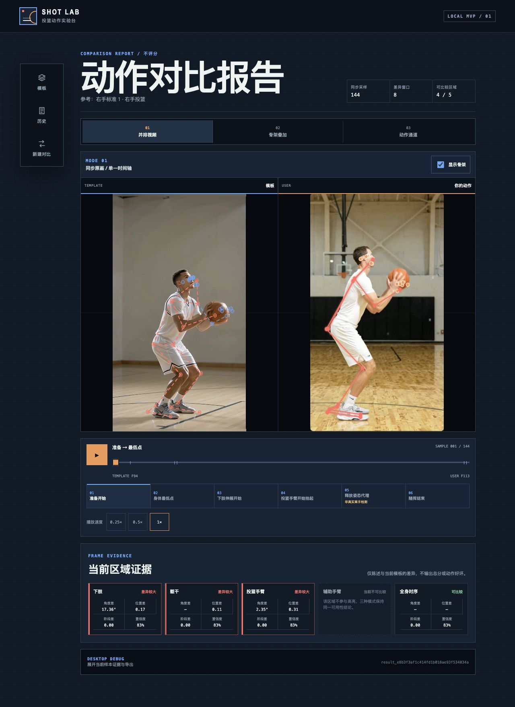
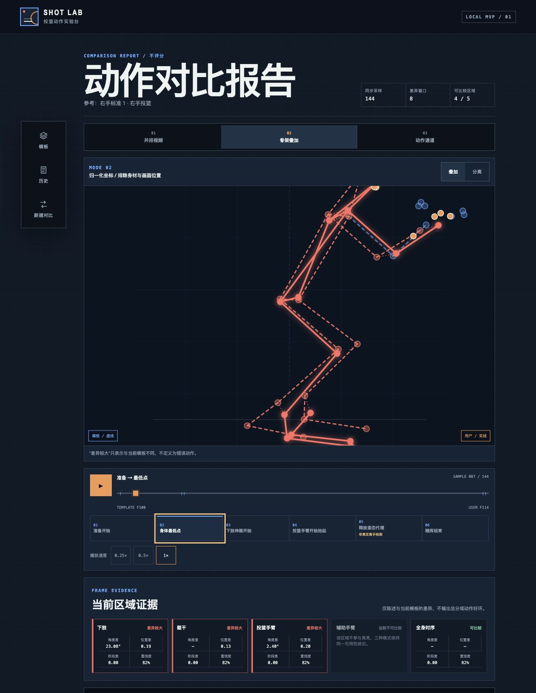
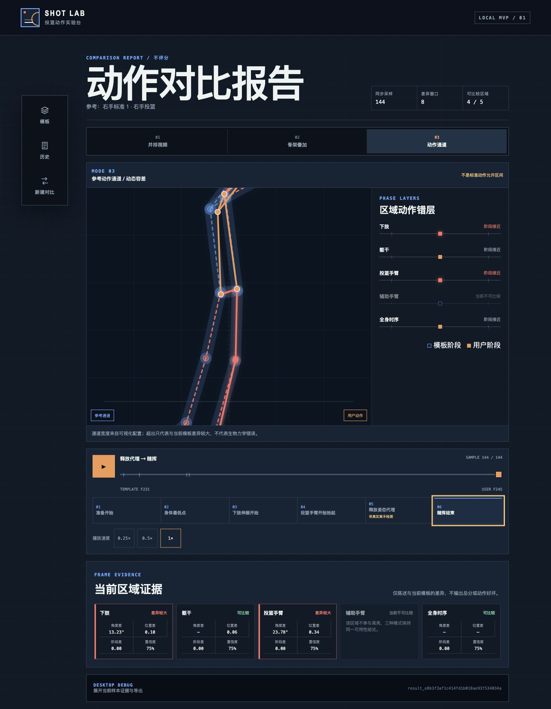
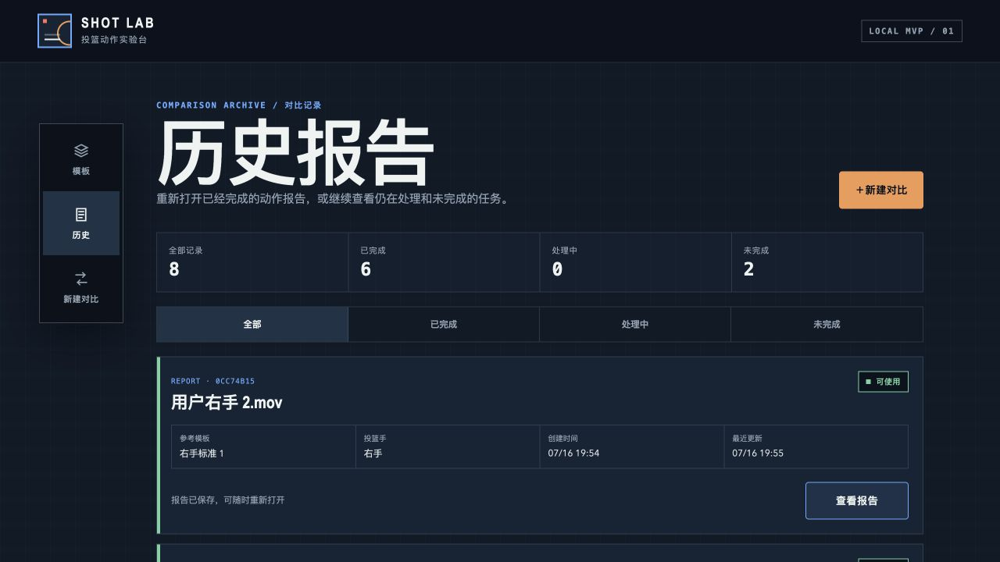

# 投篮对比报告交互与已知问题交接

更新日期：2026-07-16  
适用项目：`MvpDemo/`  
实现基线：`3ffbf84 feat: add comparison history`  
状态：问题交接，不代表改造方案已经确认

## 1. 这份交接要解决什么

当前 MVP 已经可以从真实视频生成报告，但还不能据此判断“三种对比交互是否有效”。时间轴、骨架渲染和可视区存在明显问题，它们会直接污染用户对对比效果的判断。

下一任务应先讨论并确定“用户如何直观看出自己与模板的差异”，再安排修复。不要先增加评分、训练建议或更多指标，也不要把当前报告里的“差异较大”解释成动作错误。

当前核心验证目标仍然是：

> 用户能否通过模板视频、自己的视频和必要的骨架辅助，在一次观看中直观看出动作阶段和身体部位的差异。

## 2. 当前实现与测试样本

### 2.1 当前报告模式

1. 并排视频：两段经过动作阶段对齐的预览视频，共用一个时间轴。
2. 骨架叠加：把模板和用户的归一化骨架放进同一 SVG 坐标系。
3. 动作通道：用模板骨架生成可视化通道，并叠加用户骨架和区域阶段轨道。

三种模式读取同一份 `ComparisonResult.renderTimeline`。这是当前架构约束，不代表这一条时间轴适合同时承担“原速观看”和“阶段对齐分析”。

### 2.2 本轮主要样本证据

| 对比 ID | 模板输入 | 用户输入 | 输出预览 | 主要现象 |
|---|---:|---:|---:|---|
| `cmp_50e4923141f44d94b4a7e68d0cc74b15` | 2066.667 ms / 120 FPS；事件帧 94–231 | 2200 ms / 120 FPS；事件帧 113–245 | 144 帧 / 固定 30 FPS / 4800 ms | 两秒左右的源视频在报告里接近五秒；叠加和通道出框 |
| `cmp_dc88950283b742e1b9e210d8a45cbb9c` | 2066.667 ms / 120 FPS；事件帧 94–231 | 2000 ms / 120 FPS；事件帧 92–228 | 154 帧 / 固定 30 FPS / 5133 ms | 即使素材较接近，报告仍明显慢于源视频 |

其他已知证据：

- `cmp_50e...` 的模板相机稳定性为警告，用户视频时间轴连续性为警告。
- 两侧素材均为 120 FPS，且都被标记为速度不可信；比较引擎关闭了速度特征。
- `cmp_50e...` 只有 4 / 5 个区域可比较，辅助手臂因关键点覆盖不足不可比较。
- 页面显示的“1×”是报告预览的播放倍率，不等于源视频的真实时间倍率。

## 3. 截图证据

### 3.1 并排视频：头部和手部点位过多



### 3.2 骨架叠加：整体难读，头部出框，差异连线造成噪声



### 3.3 动作通道：全身无法完整进入可视区



### 3.4 已补充的历史查询入口



## 4. 尚未解决的问题

### P0-1：“1×”实际明显慢于原视频

#### 用户现象

- 两个源视频都只有约两秒，但报告生成的预览分别为 4.8 秒和 5.13 秒。
- 页面按钮仍显示 `1×`，用户自然会把它理解为原始速度。
- 骨架叠加模式进入差异窗口时还会自动切到有效 `0.5×`，但 `1×` 按钮仍保持选中；提示文字不足以消除误解。

#### 已确认原因

1. 输入素材是 120 FPS。
2. 对齐时间轴基本按源帧逐帧生成样本。
3. Worker 把“每个时间轴样本”编码成固定 30 FPS 预览，没有按源时间戳重采样。
4. 例如约 138 个 120 FPS 源帧原本只代表约 1.15 秒，按 30 FPS 输出后会变成约 4.6 秒。
5. 速度不可信时，DTW 允许重复映射更多源帧，也可能进一步产生停顿。

代码入口：

- [`packages/comparison-engine/src/index.ts`](../packages/comparison-engine/src/index.ts)：把 `renderTimeline.length / 30` 直接定义为预览时长。
- [`services/pose-worker/app/previews/render.py`](../services/pose-worker/app/previews/render.py)：每个时间轴样本输出一帧，并固定编码为 30 FPS。
- [`apps/web/src/report/playback.ts`](../apps/web/src/report/playback.ts)：骨架叠加在差异窗口可能自动降到 `0.5×`。

#### 对用户的影响

用户无法判断看到的是原始节奏、系统对齐后的节奏，还是系统自动慢放后的节奏。节奏本身又是投篮对比的重要信息，因此当前“1×”会提供错误预期。

#### 修复方向

先做产品定义，再改代码：

- “原速观看”：严格使用两侧源时间戳。它可以分别保持真实速度，但不保证两段视频全过程逐帧对齐。
- “阶段对齐观看”：按五个动作阶段归一化时间。它可以同步阶段，但不应标为原始 `1×`，应明确叫“对齐播放”或“阶段同步”。

技术上建议把“对齐映射”和“显示时钟”拆开：时间轴样本保留两侧源时间戳，渲染层再根据所选观看模式决定显示时刻。不要继续用 `样本数 ÷ 30` 代替真实时长。

#### 验收标准

- 30 / 60 / 120 FPS 的同一段两秒动作，在“原速观看”下时长误差不超过 50 ms。
- “阶段对齐观看”必须明确标注为归一化时间，不显示容易误解的 `1×`。
- 任何自动降速都必须同步改变主状态文案和速度选中态，不能静默发生。

### P0-2：骨架和动作通道超出可视区

#### 用户现象

- 头、手或脚会被裁掉，用户无法确认当前看到的是身体哪一部分。
- 动作通道在随挥阶段尤为明显，只剩身体中段。
- 容器不能滚动，但即使允许滚动，也不符合“快速观察全身差异”的目标。

#### 已确认原因

- 两种 SVG 都使用固定 `viewBox="0 0 480 400"`。
- 归一化点固定使用 `x = 240 + point.x × 150`、`y = 175 + point.y × 150`。
- `.normalized-stage` 使用 `overflow: hidden`。
- 动作通道还有额外描边宽度，但视图没有把通道半径计入边界。

代码入口：

- [`apps/web/src/report/Skeleton.tsx`](../apps/web/src/report/Skeleton.tsx)
- [`apps/web/src/report/SkeletonOverlayRenderer.tsx`](../apps/web/src/report/SkeletonOverlayRenderer.tsx)
- [`apps/web/src/report/MotionChannelRenderer.tsx`](../apps/web/src/report/MotionChannelRenderer.tsx)
- [`apps/web/src/styles.css`](../apps/web/src/styles.css)

#### 对用户的影响

这是展示层 P0，不是素材质量问题。即使识别和对齐都正确，只要全身不在画面内，对比模式就无法完成基本任务。

#### 修复方向

- 计算模板骨架、用户骨架和通道宽度的联合包围盒。
- 根据容器尺寸和安全边距生成统一的 `scale + translate`。
- 缩放应基于整个动作或一个稳定阶段的边界，不能逐帧自动缩放，否则画面会呼吸和抖动。
- 极端低置信度离群点不能参与视图边界。
- 叠加和通道必须共享同一个 `fit-to-view` 工具和测试。

#### 验收标准

- 所有可展示核心关节在每一帧都位于安全区内。
- 通道描边也不能被裁切。
- 播放过程中视图缩放和中心不发生逐帧跳变。
- 用户不需要横向或纵向滚动才能看到完整骨架。

### P0-3：骨架点太多，头部和手部像噪声

#### 用户现象

头部出现眼、耳、嘴周围多个圆点，手腕附近出现手指点。并排视频和骨架叠加中都很难快速识别主骨架。

#### 已确认原因

MediaPipe 输出 33 个点是正常的，数据层也应该保留 33 个点；问题出在用户界面把 `points` 中所有高于置信度阈值的点都画成圆点，而连线只使用其中一部分。

代码入口：

- [`services/pose-worker/app/pose/mediapipe_backend.py`](../services/pose-worker/app/pose/mediapipe_backend.py)：保留完整 33 点。
- [`apps/web/src/report/Skeleton.tsx`](../apps/web/src/report/Skeleton.tsx)：对所有点执行 `points.map(...<circle />)`。

#### 修复方向

- 数据层继续保留 33 点，保证分析、调试和未来能力不丢失。
- 用户视图只渲染语义清晰的核心关节，例如鼻、肩、肘、腕、髋、膝、踝；脚部最多增加脚跟或脚尖表达朝向。
- 眼、耳、嘴和手指点只放在调试开关中。
- 核心关节集合应由一个统一常量控制，三种模式不能各自定义。

#### 验收标准

- 默认骨架一眼可辨认头、躯干、双臂、双腿和脚部方向。
- 用户视图不再出现眼睛、嘴、手指组成的点簇。
- 调试模式仍可查看完整 33 点及置信度。

### P0-4：播放卡顿，动作像机器人

#### 用户现象

- 骨架播放断断续续，关节会停一下再跳到下一位置。
- 两个骨架即使已经对齐，也不像连续人体动作。

#### 已确认原因与待验证原因

已确认：

- 骨架叠加和动作通道使用 `setInterval` 按离散样本推动 React 状态。
- 报告渲染直接使用 MediaPipe 原始关键点；当前平滑只用于事件信号，不用于展示骨架。
- DTW 路径允许一个源帧映射到多个输出样本，速度不可信时重复上限还会放宽。

待验证：

- 主线程 React 重绘是否造成额外丢帧。
- 当前样本中实际连续重复帧的比例，以及关节跳变的峰值。
- 视频帧回调、SVG 更新和报告证据区同时重绘是否互相影响。

#### 修复方向

- 先增加诊断：重复帧比例、相邻关节位移、实际渲染 FPS、长任务耗时。
- 用一个基于 `requestAnimationFrame` 的主时钟驱动三种模式。
- 在相邻映射帧之间插值，不要把重复映射直接表现为“停住”。
- 对“展示副本”做轻量时序平滑，原始关键点保持不可变；可比较 One Euro、低延迟 Savitzky–Golay 或受置信度约束的指数平滑。
- 平滑必须保护六个事件锚点，不能为了视觉丝滑改变分析证据。

#### 验收标准

- 桌面端目标渲染 60 FPS；主时间轴不依赖 React 每帧重建整份报告。
- 关键关节无可见停顿或单帧跳跃。
- 原始数据、分析数据和展示平滑数据在调试区可区分。
- 三种模式在同一时刻仍指向同一对齐证据。

### P1-1：骨架之间的差异连线没有帮助理解

#### 用户现象

多条虚线横跨两个骨架，看起来像在说明关联，但无法回答“我具体哪里不同、应关注哪个关节”。播放时连线跟随跳动，视觉噪声更强。

#### 已确认原因

当前实现对每个高亮区域的多个关节分别画一条模板到用户的连线。一个区域高亮时会同时出现多条线，多个区域高亮时会叠加。

代码入口：[`apps/web/src/report/SkeletonOverlayRenderer.tsx`](../apps/web/src/report/SkeletonOverlayRenderer.tsx) 中的 `DifferenceLinks`。

#### 修复方向

下一任务应先比较三种表达，不要直接美化现有连线：

1. 只高亮身体区域，不画跨骨架连线。
2. 暂停或拖动时，只显示当前主要问题关节的一根位移向量。
3. 使用半透明残影或局部角度弧线表达差异。

默认播放态应优先减少信息，详细几何证据放到暂停态或“查看差异”操作中。

### P1-2：拍摄角度和构图不同会让叠加结果失真

#### 用户现象

即使两段视频都被认为是“侧面”，人物朝向、相机高度、透视、远近和裁切不同，叠加结果仍然别扭。用户难以区分动作差异与拍摄差异。

#### 当前边界

- 兼容性只检查离散类别 `shooting_side`，没有量化两个素材的视角差。
- 根节点平移和肢段长度会归一化，但单目 2D 无法消除透视和出平面旋转。
- Demo 阶段相机移动、变焦和部分角度问题多为软门禁，允许继续生成报告。

代码入口：

- [`packages/comparison-engine/src/compatibility/check.ts`](../packages/comparison-engine/src/compatibility/check.ts)
- [`packages/comparison-engine/src/retarget/pair.ts`](../packages/comparison-engine/src/retarget/pair.ts)

#### 修复方向

- 增加“对比适配度”，单独描述角度、构图、全身覆盖和相机稳定性，不把这些差异算成动作错误。
- 适配度不足时仍可允许并排查看，但应降低或关闭骨架叠加和动作通道，避免输出伪精确结果。
- 下一任务要明确 MVP 接受的拍摄范围；不要假设 2D 归一化可以修复所有视角差。

### P1-3：报告指标对普通投篮用户不够可读

#### 用户现象

- `角度差 23.08°`、`位置差 0.20`、`阶段差 0.00` 缺少直观含义。
- 用户不知道应该先看哪一项，也不知道差异发生在抬球、伸膝还是随挥。
- `SAMPLE`、模板帧和用户帧属于调试信息，不应成为主体验的一部分。
- “差异较大不代表错误”的边界是正确的，但重复声明边界不能替代对比解释。

#### 修复方向

下一任务应先确定报告的信息层级：

1. 第一层：当前阶段 + 最值得看的一个身体区域。
2. 第二层：并排/叠加的直接视觉证据。
3. 第三层：角度、位置、置信度和帧映射等技术证据。

是否输出“如何改”是单独的产品和算法问题。当前系统没有生物力学诊断能力，不能把模板差异直接翻译为纠正建议。

### P2-1：曾出现“无法播放媒体”，当前未稳定复现

早期报告截图中一侧或两侧出现过“无法播放媒体”。当前本轮页面能播放，因此不能把它标为已确认持续故障。

后续如再次出现，应保存以下证据：

- 浏览器控制台和媒体错误码。
- 预览文件 Range 请求状态、`Content-Range` 和 MIME。
- 预览文件是否仍存在、是否能被 `ffprobe` 解码。
- 是否只发生在历史报告或服务重启后。

## 5. 已处理的问题和保留影响

### 5.1 Worker 时间戳 400

曾出现 `Input timestamp must be monotonically increasing.`。当前 Worker 会在源时间戳重复或倒退时回退到帧率推导时间，并保证时间戳至少比上一帧增加 1 ms；不同视频之间也会重建 MediaPipe 跟踪器。

状态：工程故障已处理。  
保留风险：质量报告仍会把原视频时间轴跳变记录为警告，它可能影响真实节奏解释。

### 5.2 两秒完整投篮被时长门禁拦截

当前模板和用户视频的最小时长已允许到 1 秒，自动测试覆盖两秒完整投篮。

状态：已处理。

### 5.3 正常速度确认 checkbox 和变速硬门禁

前端 checkbox 已移除；模板和用户视频可以包含慢放或剪辑变速。系统把 `normalSpeedConfirmed` 记为 `false`，比较时关闭时间戳速度特征。

状态：上传阻断已处理。  
保留影响：因为所有素材都被视为速度不可信，对齐会放宽重复帧限制；如果继续把 DTW 路径直接当播放时间轴，卡顿和时长失真会更明显。

### 5.4 Demo 门禁过严

帧率、分辨率、视角、相机稳定性、部分覆盖和时间轴问题在 Demo 阶段主要记为 warning，先尝试生成报告。无法解码、没有姿态帧、人物跟踪确实歧义、无法形成六个有序事件或缺少必要共同区域仍会拒绝。

状态：已按“软门禁优先”处理。  
保留影响：报告必须显式区分“动作差异”和“素材可比性不足”，不能因为流程放行就假设结果可靠。

### 5.5 历史报告没有查询入口

已新增 `#/comparisons`，主导航加入“历史”，支持查看成功报告、处理中任务和未完成任务，并按状态筛选。

状态：已处理，提交 `3ffbf84`。

## 6. 下一任务必须先做的产品决策

### 决策 A：原速与阶段同步是否拆成两个观看模式

建议拆开。原速用于感受真实节奏，阶段同步用于精确比较动作位置。两者不能继续共用一个含义模糊的 `1×`。

### 决策 B：三种模式是否都保留为同等入口

需要重新验证。当前最有机会形成主路径的是“并排视频 + 可开关的简化骨架”。骨架叠加和动作通道可以先作为候选实验，不应因为已经实现就默认都放在一级入口。

### 决策 C：叠加模式面对角度不匹配时怎么降级

至少需要三档：可可靠叠加、仅供参考、不可叠加。不可叠加时仍可以保留并排视频，但不能继续显示精确位置差。

### 决策 D：播放态和暂停态分别展示多少证据

建议播放态只看整体动作；暂停、拖动或点击关键阶段后再出现局部差异、角度和置信度。当前把所有证据同时展示，会让用户先读数字而不是看动作。

### 决策 E：当前 MVP 是否提供纠正建议

如果目标只是验证对比交互，先不输出“动作好坏”和训练建议。可以输出客观差异描述，但需要把“模板不同”和“需要纠正”严格分开。

## 7. 建议修复顺序

1. 修复 120 FPS → 30 FPS 的时间基准错误，重新定义原速与对齐播放。
2. 为叠加和通道实现稳定的全动作 `fit-to-view`。
3. 默认只绘制核心关节，完整 33 点移到调试模式。
4. 增加重复帧、关节跳变和渲染 FPS 诊断，再做插值和平滑。
5. 重新设计差异连线及播放态的信息密度。
6. 增加素材适配度和模式降级策略。
7. 最后再重排报告指标和是否给出用户建议。

这个顺序的原因是：前四项会改变用户实际看到的动作。如果先改颜色、文案或卡片布局，仍然无法判断核心对比交互是否成立。

## 8. 下一轮验收建议

准备三组固定样本，每组都保留原视频、质量报告、动作产物和报告截图：

1. 同一视频对比自己：验证时间轴、骨架重合和渲染稳定性。
2. 同角度、不同动作：验证系统能否突出真实动作差异。
3. 相近动作、不同角度或构图：验证适配度警告和模式降级。

必须记录：

- 源视频时长、FPS 和事件时间戳。
- 原速播放实际时长与误差。
- 对齐播放的阶段映射和重复帧比例。
- 每帧核心骨架是否完整进入可视区。
- 实际渲染 FPS 和关键关节最大跳变。
- 用户能否在不读技术数字的情况下指出至少一个真实差异。

## 9. 复现入口

```bash
cd /Users/zn/workspace/shotAI/MvpDemo
pnpm dev
```

- 历史报告：`http://127.0.0.1:5173/#/comparisons`
- 主要问题样本：`http://127.0.0.1:5173/#/reports/cmp_50e4923141f44d94b4a7e68d0cc74b15`
- 相近素材样本：`http://127.0.0.1:5173/#/reports/cmp_dc88950283b742e1b9e210d8a45cbb9c`

复现时依次查看并排视频、骨架叠加和动作通道，分别测试准备、最低点、释放姿态代理和随挥结束四个阶段。不要只看静态首帧。
